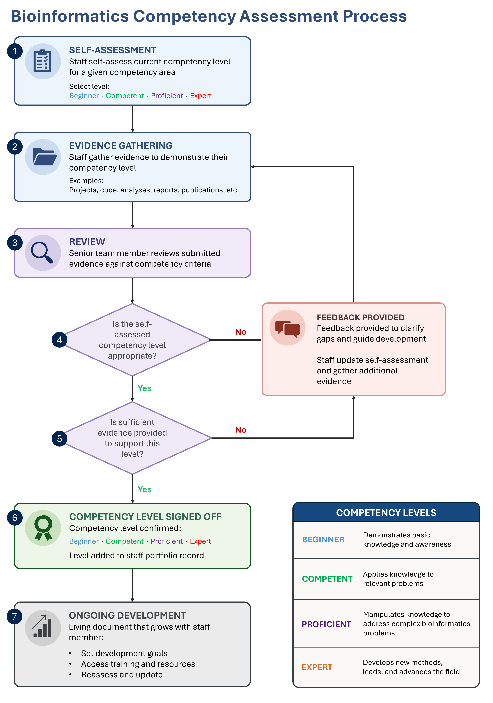

=====================================
Assessing competency using portfolios
=====================================

Purpose of the portfolio approach
----------------------------------

To support assessment against the competency framework, a portfolio-based approach
is proposed as the primary method for evidencing achievement at each level within
each competency area. This approach is adapted from established practice within
scientific and clinical training programmes, including the NHS Scientist Training
Programme (STP), where portfolios are used to demonstrate progress and capability.

Portfolios were chosen because they provide a flexible and authentic way to evidence
competency. Bioinformatics work rarely follows a single, standardised pattern, and
staff often gain experience through different projects, tools, and responsibilities.
A portfolio allows this diversity to be captured by enabling staff to select evidence
that best reflects their own experience. This approach also supports reflective
practice, encourages staff to consider how their work aligns with specific
competencies, and creates a structured record of development over time.

.. note::

   The portfolio model accommodates prior learning and previous experience. Formal
   education — such as a PhD or master's degree — may demonstrate competencies in
   areas such as statistical methods, data interpretation, or scientific
   communication. Experience from previous roles or research projects can similarly
   be included where it clearly aligns with the competency being assessed.

------------------------------------------------------------------------

How the portfolio assessment process works
-------------------------------------------

The flowchart below summarises the assessment cycle. Staff self-assess their current
level for each competency sub-area, gather supporting evidence, and submit it for
review by a senior team member. Evidence is assessed against two criteria: whether
the claimed level is appropriate, and whether the evidence provided is sufficient to
support it. Where either criterion is not met, feedback is provided and the submission
is strengthened before resubmission. Once signed off, the competency level is recorded
in the staff portfolio and the cycle continues as skills develop.

   Figure 1: The portfolio assessment cycle — from self-assessment through
   evidence gathering and review to ongoing development.

------------------------------------------------------------------------

Recording competency evidence
------------------------------

For each competency sub-area, staff record their claimed level and provide evidence
demonstrating how that level has been achieved. The table below shows the structure
used to capture this information. Each row corresponds to a competency sub-area;
staff complete the level, evidence, and description columns before submission for
review.

.. list-table::
   :header-rows: 1
   

------------------------------------------------------------------------

Types of evidence
------------------

A broad range of evidence types can be used within a portfolio. Evidence should be
selected because it clearly demonstrates capability at the claimed level — not simply
because it exists. Each piece of evidence should be accompanied by a short description
explaining how it relates to the specific competency being assessed.

There is no fixed minimum or maximum number of pieces of evidence per sub-area.
The aim is to provide material that is relevant and sufficient, not exhaustive.
Where a single piece of evidence clearly demonstrates a competency, that is enough.
Where the competency is broad or complex, multiple pieces may be appropriate.

.. raw:: html

   

.. raw:: html

   

.. raw:: html

   

     

       

         

           
Analysis outputs

           
click for more detail

         

         

           
Analysis summaries, reports, or interpretation write-ups that demonstrate analytical reasoning and conclusions drawn from data.

         

       

     

     

       

         

           
Code and workflows

           
click for more detail

         

         

           
Workflow scripts, code snippets, or links to repositories demonstrating pipeline development, software engineering, or automation work.

         

       

     

     

       

         

           
Documentation

           
click for more detail

         

         

           
SOPs, protocols, or technical documentation produced as part of routine quality management or service development activities.

         

       

     

     

       

         

           
Presentations and training

           
click for more detail

         

         

           
Presentations, posters, or training materials demonstrating communication of bioinformatics concepts to scientific or clinical audiences.

         

       

     

     

       

         

           
Quality activities

           
click for more detail

         

         

           
Audit or validation outputs evidencing engagement with quality management processes and regulatory requirements.

         

       

     

     

       

         

           
Reflective statements

           
click for more detail

         

         

           
Written reflections describing learning from a project, incident, or development activity, linking experience to specific competencies.

         

       

     

   

------------------------------------------------------------------------

Benefits of the portfolio approach
------------------------------------

.. grid:: 2
   :gutter: 3

   .. grid-item-card:: For individual staff
      :class-card: sd-bg-primary sd-text-white

      Supports structured reflection, clarifies expectations, and helps identify
      training and development needs as skills grow over time.

   .. grid-item-card:: For the team
      :class-card: sd-bg-primary sd-text-white

      Provides visibility of skills across the group, highlights strengths and
      gaps, and supports planning for resilience, succession, and targeted
      training.