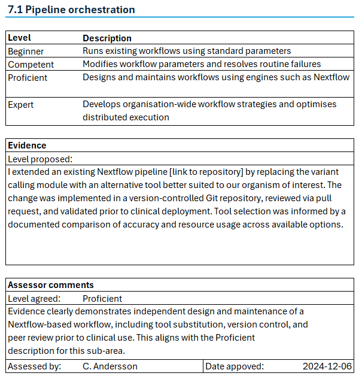
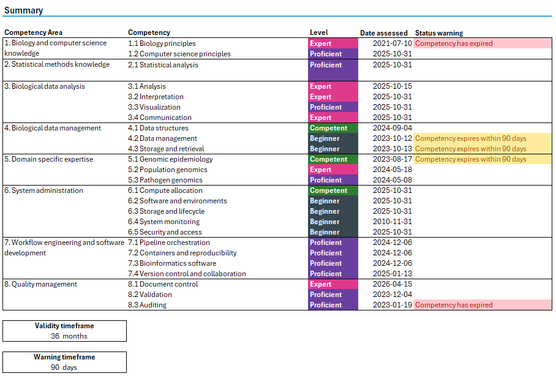

=====================================
Assessing competency using portfolios
=====================================

Purpose of the portfolio approach
----------------------------------

To support assessment against the competency framework, a portfolio-based
approach is proposed as the primary method for evidencing achievement at each
level within each competency area. This approach is adapted from established
practice within scientific and clinical training programmes, including the
NHS Scientist Training Programme (STP), where portfolios are used to
demonstrate progress and capability.

Portfolios were chosen because bioinformatics work rarely follows a single,
standardised pattern, instead staff gain experience through a wide range of
projects, tools, and responsibilities. A portfolio allows this diversity
to be captured on its own terms rather than forced into a single assessment
format. This flexibility also supports reflective practice: staff are
encouraged to consider explicitly how their work aligns with specific
competencies, creating a structured record of development over time rather
than a one-off snapshot.

.. note::

   The portfolio model accommodates prior learning and previous experience. Formal
   education, e.g. a PhD or master's degree, may demonstrate competencies in
   areas such as statistical methods, data interpretation, or scientific
   communication. Experience from previous roles or research projects can similarly
   be included where it clearly aligns with the competency being assessed.

--------------------------------------------------------------------

How the portfolio assessment process works
-------------------------------------------

The flowchart below summarises the assessment cycle. Staff self-assess their
current level for each competency sub-area, gather supporting evidence, and
submit it for review by a senior team member. Evidence is assessed against
two criteria: whether the claimed level is appropriate, and whether the
evidence provided is sufficient to support it. Where either criterion is not
met, feedback is given and the submission is strengthened before
resubmission. Once signed off, the competency level is recorded in the staff
portfolio, and the cycle continues as skills develop.

.. figure:: ../_static/competency_assessment_flowchart.png
   :align: center
   :width: 650px
   :alt: Flowchart showing the seven-step portfolio assessment process.

   Figure 1: The portfolio assessment cycle, from self-assessment through
   evidence gathering and review to ongoing development.

--------------------------------------------------------------------

Types of evidence
------------------

A broad range of evidence types can be used within a portfolio. Evidence should be
selected because it clearly demonstrates capability at the claimed level — not simply
because it exists. Each piece of evidence should be accompanied by a short description
explaining how it relates to the specific competency being assessed.

There is no fixed minimum or maximum number of pieces of evidence per sub-area.
The aim is to provide material that is relevant and sufficient, not exhaustive.
Where a single piece of evidence clearly demonstrates a competency, that is enough.
Where the competency is broad or complex, multiple pieces may be appropriate.

.. raw:: html

   

   

.. raw:: html

   

     

       

         

           
Analysis outputs

           
click for more detail

         

         

           
Analysis summaries, reports, or interpretation
           write-ups that demonstrate analytical reasoning and conclusions drawn
           from data.

         

       

     

     

       

         

           
Code and workflows

           
click for more detail

         

         

           
Workflow scripts, code snippets, or links to
           repositories demonstrating pipeline development, software engineering,
           or automation work.

         

       

     

     

       

         

           
Documentation

           
click for more detail

         

         

           
SOPs, protocols, or technical documentation
           produced as part of routine quality management or service development
           activities.

         

       

     

     

       

         

           
Presentations and training

           
click for more detail

         

         

           
Presentations, posters, or training materials
           demonstrating communication of bioinformatics concepts to scientific
           or clinical audiences.

         

       

     

     

       

         

           
Quality activities

           
click for more detail

         

         

           
Audit or validation outputs evidencing engagement
           with quality management processes and regulatory requirements.

         

       

     

     

       

         

           
Reflective statements

           
click for more detail

         

         

           
Written reflections describing learning from a
           project, incident, or development activity, linking experience to
           specific competencies.

         

       

     

   

--------------------------------------------------------------------

Assessment records
------------------

Regardless of how competency is assessed, a record must be kept of the level
achieved for each competency sub-area, the evidence relied upon, and the date
that assessment took place. Since competency levels are not permanent and are
subject to periodic reassessment (see :ref:`ongoing-assessment` below), the
validity period of each assessment must also be tracked, so that competencies
approaching expiry or already expired can be identified.

To support this, we have developed a template that can be used both to
record individual pieces of evidence and to track assessment status across
all competency areas.

**Recording individual evidence**

Each competency sub-area has its own evidence record, structured around the
level descriptors for that sub-area. Staff record the level they believe they
have achieved, along with a short evidence statement explaining how it has
been demonstrated. A senior team member then reviews the submission, agrees a
final level, and signs it off with the date of approval.

         showing assessed levels from Beginner to Expert, an evidence statement at
         Proficient level, and an approver sign-off section.

   Figure 2: Example competency evidence record for sub-area 7.1 Pipeline
   Orchestration, showing the assessed level, supporting evidence statement,
   and reviewer sign-off.

**Tracking overall status**

A summary sheet draws together the agreed level and assessment date for
every competency sub-area into a single view. Levels are colour-coded to
match the scheme used throughout this guide, making current status easy to
see at a glance. Based on a validity timeframe and warning timeframe defined
within the record, a status warning is generated automatically alongside any competency that is approaching or has passed its reassessment date.

         areas and their sub-areas, each with a colour-coded assessed level and
         date last assessed, alongside validity and warning timeframe settings.

   Figure 3: Example competency assessment summary record, showing assessed
   levels across all competency areas, colour-coded to match the competency
   level scheme, alongside the date each level was last assessed.

.. button-link:: ../_static/bioinformatics_competency_assessment_record_v0.1.xlsx
   :color: primary
   :expand:

   Download competency assessment template

--------------------------------------------------------------------

Ongoing assessment
------------------

The ISO standards require that competency is periodically reassessed to ensure that staff maintain their capability over time. This is regardless of whether the competency has been assessed through a portfolio or DOP. The reassessment interval should be defined by the laboratory, taking into account the nature of the competency, the frequency of its use, and frequency of changes in the relevant technology or procedures. A typical reassessment interval may be every 1-2 years, but this should be tailored to the specific context and risk profile of the laboratory.
